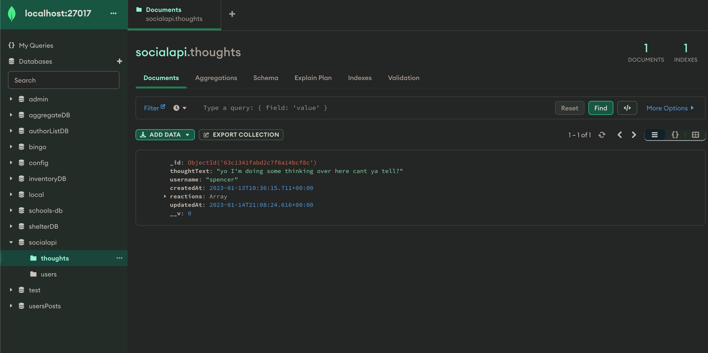
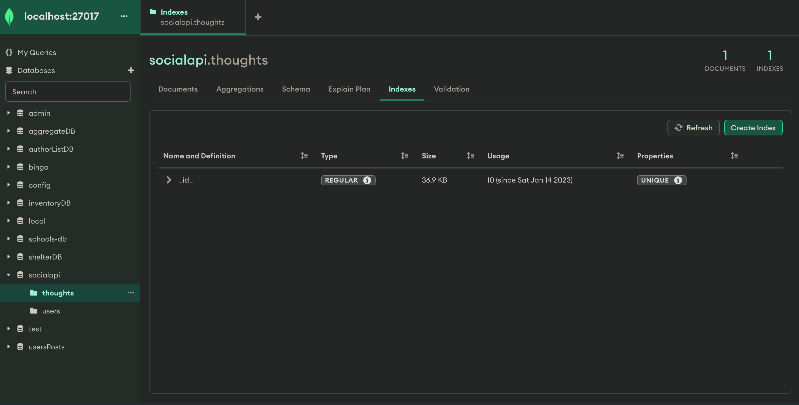
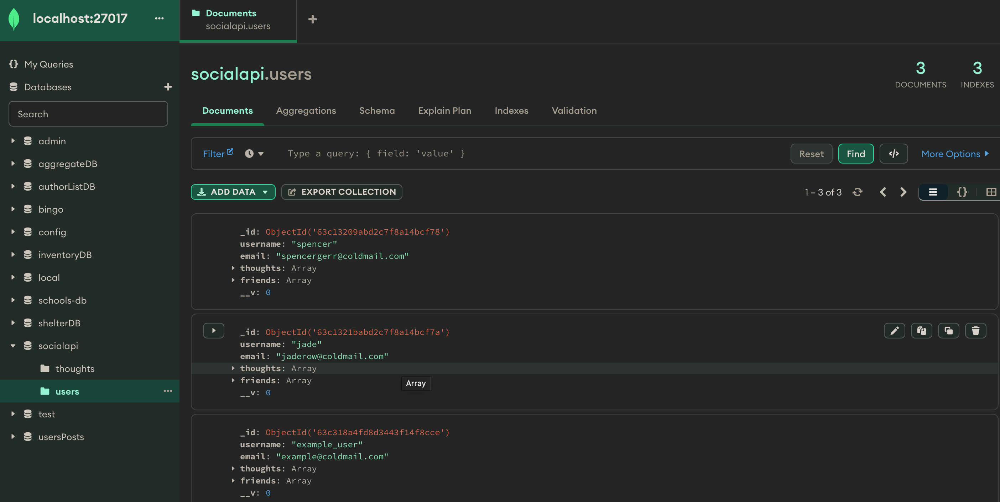
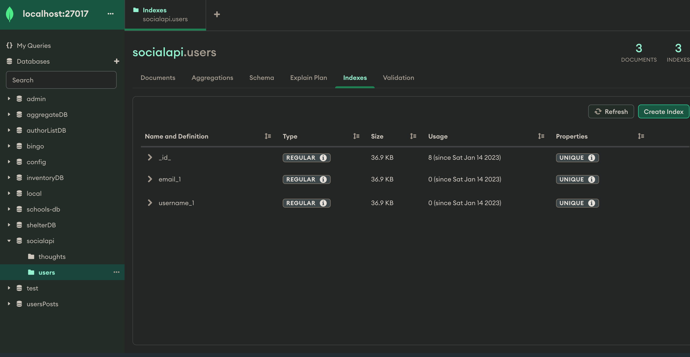

# Minka - Developers notes and questions forum
  
  ## Table of Contents
  * [Description](#description)
  * [Installation](#installation)
  * [Usage](#usage)
  * [Licenses](#licenses)
  * [Contributing](#contributing)
  * [Tests](#tests)
  * [Questions](#questions)
  * [Credits](#credits)

  ## Description 
  AS A social media startup
I WANT an API for my social network that uses a NoSQL database
SO THAT my website can handle large amounts of unstructured data
  
   
    
     
## Installation 
 git clone code or download repo as a zip
## Usage 
"npm i/npm install", "npm i mongoose", "npm i express"
Use Insomnia to view routes
## Licenses 
  ## Licenses
    This project is covered under the MIT license. To learn more about what this means, click the license button at the top.
## Contributing 
send suggestions for new content or features to "spencergerritsen@gmail.com"
## Tests 

## Questions 
Any questions about the project?
Github: https://github.com/sppencerr
Email: spencergerritsen@gmail.com
## Credits 
sppencerr
